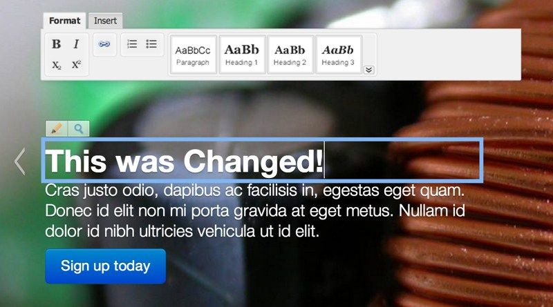

====================
Django Aloha Editor
====================

The Django Aloha Editor is a WYSIWYG editor for all your Django powered websites
By default it always uses the latest version of Aloha Editor http://aloha-editor.org/

How it works
============
Django Aloha Editor checks the user permissons, wraps the content with an aloha editor 
 and
saves the edited content with an AJAX call.

Installation
============

#. pip install django-aloha-editor

#. Add the following url to your project's `urls.py` file:

	``url(r'^__alohaeditor__/', include('aloha_editor.urls', namespace='aloha_editor')),``

#. Add ``aloha_editor`` to your ``INSTALLED_APPS`` setting so Django can find the
   template files and template tags associated with Aloha Editor.

Example
=======

views.py
--------

.. code-block:: python

    from django.shortcuts import render_to_response
    from books.models import Book

    def book_detail(request, book_id):
        try:
            book = Book.objects.get(pk=book_id)
        except Book.DoesNotExist:
            raise Http404
        return render_to_response('book_detail.html', {'book': book})

book_detail.html
----------------

.. code-block:: html

    
    <html>
    <head>
      
        
        
      
    </head>
    <body>
      
    </body>
    </html>

TODOs and BUGS
==============
You found a bug or have a suggestion for improvement, please let me know!

See: http://github.com/baskoopmans/django-aloha-editor/issues
